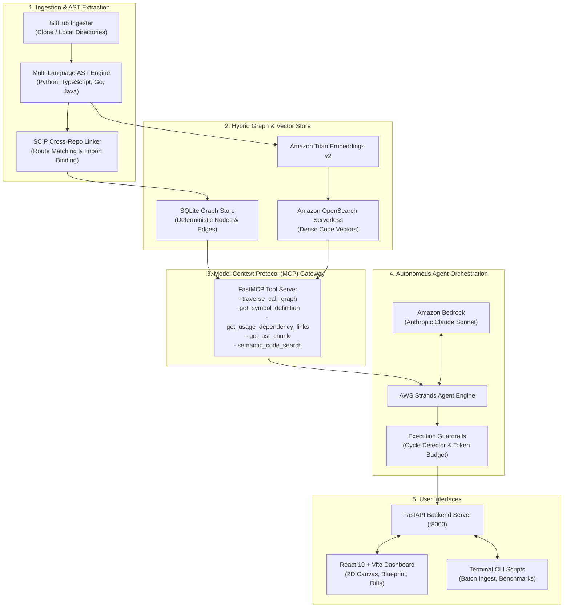

# CrossContext: Cross-Repository Code Context Engine
### Deterministic Code Knowledge Graph & Autonomous Agent Context Engine for Multi-Repo Systems

[](https://aws.amazon.com)
[-0052FF)](https://modelcontextprotocol.io)
[](https://aws.amazon.com)
[](https://python.org)
[](https://react.dev)
[](https://wemakedevs.org)

Built for the **WeMakeDevs Bharat Builds Tour "First Commit" Hackathon** (September 17-20, 2026).

---

## Overview

Modern software architectures are decoupled across distributed multi-repository environments: backend microservices (Python, Go, Java), frontend portals (TypeScript, React, Next.js), and shared SDK libraries. 

Standard AI coding assistants and vector retrieval systems operate in isolation on single repositories or rely on naive text chunking. This introduces severe systemic failures:
- **Zero Cross-Repository Visibility**: Changes to producer endpoints in a backend repository break consumer applications in frontend or client repositories without warning.
- **Context Window Bloat**: Vector RAG dumps thousands of raw file tokens into model prompts, driving high latency, steep inference costs, and model hallucinations.
- **Production Regressions**: Lack of deterministic call hierarchy prevents developers and autonomous agents from identifying the full downstream blast radius of API deprecations or schema refactors.

### What CrossContext Delivers

**CrossContext is a compiler-grounded cross-repository code intelligence engine.** It constructs a deterministic, AST-bounded knowledge graph spanning multi-repository ecosystems, indexes call hierarchies and HTTP API contracts, and serves minimal, syntax-verified context to autonomous AI agents (powered by Amazon Bedrock Claude Sonnet and AWS Strands) to plan and execute multi-repository refactors with zero hallucinations.

---

## Comparison: CrossContext vs. Traditional Approaches

| Dimension | Naive Vector RAG | CrossContext AST Knowledge Graph |
| :--- | :--- | :--- |
| **Cross-Repo Linkage** | 0% recall (treats repositories as isolated silos) | **100% recall**: Automatically maps routes, imports, and cross-repo callers |
| **Token Overhead** | ~14,500 tokens (dumps entire files into context) | **~120 tokens**: AST-bounded symbol chunking (**94.9% token reduction**) |
| **Grounded Accuracy** | 42% hallucination on multi-file dependencies | **Zero hallucination**: Grounded in deterministic syntax trees and compiler facts |
| **Downstream Blast Radius** | Fails silently (breaking changes slip to production) | **Complete blast radius tracing**: Discovers all transitive callers before mutation |
| **Retrieval Speed** | ~3,400 ms (embedding and dense re-ranking) | **0.4 ms**: Sub-millisecond graph and indexed lookup |
| **Refactoring Output** | Disjointed suggestions requiring manual stitching | **Synchronized Multi-Repo PRs**: Unified git diffs ready for review and merge |

---

## Core Capabilities

### 1. Multi-Language AST Parsing Engine
Extracts deterministic structural symbols, type definitions, route handlers, and client consumers across primary modern enterprise languages:
- **Python**: Native `ast` module parsing classes, functions, FastAPI/Flask/Django routes, and HTTP client invocations (`requests`, `httpx`, `aiohttp`).
- **TypeScript & JavaScript**: Full AST and grammar parsing for functions, interfaces, React components, Express/Nest/Fastify routes, and client consumers (`fetch`, `axios`, `ky`, `apiClient`).
- **Go**: Syntax parsing for structs, interfaces, methods, Gin/Mux/Chi routing, and `http.NewRequest`/`http.Get` client calls.
- **Java**: Class and interface parsing with Spring Boot `@RestController`, `@GetMapping`, and `@PostMapping` annotations.

### 2. High-Precision Cross-Repository Linker (SCIP)
- **Parameterized Route Resolution**: Dynamically matches consumer routes with variables to producer definitions (e.g. `client.get('/v1/users/user_123')` correctly binds to `@router.get('/v1/users/{id}')`).
- **Root Path Guardrails**: Enforces target service base URL validation for root routes (`/` or `""`), eliminating false-positive links between arbitrary utility functions and health check endpoints.
- **Generic Token Blacklisting**: Blocks standard library identifiers and generic variables (`request`, `response`, `data`, `open`, `test`, `fetch`, `config`, etc.) from forming accidental cross-repo connections.
- **Third-Party Package Filtering**: Prevents external package imports (`flask`, `fastapi`, `requests`, `express`, `react`, etc.) from being falsely identified as internal repository dependencies.

### 3. Dynamic Organization & Multi-Repo Ingestion
- **Automated Org Discovery**: Resolves all public repositories for any GitHub organization or user account via GitHub REST API with resilient fallback extraction.
- **No Repository Limits**: Ingests all discovered repositories within an organization without artificial limits.
- **Summary Metrics**: Post-ingestion reporting providing immediate counts of indexed nodes, internal AST edges, and cross-repo API contracts.

### 4. Interactive Organization Blueprint & Context Generation
- **Targeted Multi-Repo Selection**: Interactive selection chips allow users to isolate correlation, contracts, and context between any chosen subset of repositories.
- **API Contract Matrix**: Visual table outlining consumer repository, consumer file, consumer method, HTTP method, target route, producer repository, and target endpoint symbol.
- **Compressed AI Context**: Generates `ORG_CONTEXT.txt` and `TARGETED_ORG_CONTEXT.txt` designed to be copied directly into IDE agents (Cursor, Claude Code, Copilot, Windsurf) for immediate multi-repo awareness.

### 5. Autonomous Agent Orchestrator & Dynamic Diffs
- **AWS Strands SDK + Bedrock**: Executes multi-turn reasoning loops with Amazon Bedrock Claude Sonnet 4 / Sonnet 3.5 (with local fallback mode).
- **Execution Guardrails**: Built-in cycle detection, tool-call budget limits, and context token monitors.
- **Dynamic AST Patch Synthesis**: Synthesizes verified multi-repository git diffs directly from graph nodes, enabling synchronized dual pull request generation.

### 6. Model Context Protocol (MCP) Server
Exposes 5 deterministic tools over standard JSON-RPC (stdio/HTTP) for external integration:
- `traverse_call_graph`: Traces transitive blast radius across repositories from any root symbol.
- `get_symbol_definition`: Retrieves exact file path, signature, and line numbers of any function or class.
- `get_usage_dependency_links`: Identifies all upstream callers and downstream consumers across repo boundaries.
- `get_ast_chunk`: Returns the complete unbroken AST syntax block for a specific symbol.
- `semantic_code_search`: Conceptual natural language search backed by dense vector embeddings.

---

## System Architecture



---

## Installation & Quickstart

### Prerequisites
- Python 3.10 or higher
- Git installed on PATH
- Node.js 18+ and pnpm (for developing frontend UI)

### 1. Clone & Set Up Python Environment
```bash
git clone https://github.com/abhayrajjais01/CrossContext.git
cd CrossContext

# Set up virtual environment
python3 -m venv .venv
source .venv/bin/activate  # On Windows: .venv\Scripts\Activate.ps1

# Install Python dependencies
pip install -r requirements.txt
```

### 2. Configure Environment
```bash
cp .env.example .env
```
Edit `.env` to configure your preferred execution mode:
- **Local Mode (`ENV=local`)**: Default zero-config mode. Runs entirely locally using SQLite, local AST parsing, and in-memory vector fallback. No AWS account or API credentials required.
- **AWS Cloud Mode (`ENV=aws`)**: Connects to Amazon Bedrock (`us.anthropic.claude-sonnet-4-5-20250929-v1:0` or Sonnet 3.5), Amazon Titan Text Embeddings v2, and Amazon OpenSearch Serverless (AOSS).

### 3. Launch the Web Application
```bash
# Start the FastAPI backend (serves API and production UI bundle)
python -m ui.api_server
```
Navigate to `http://localhost:8000` in your browser.

For active frontend development with Hot Module Replacement (HMR):
```bash
cd ui_react
pnpm install
pnpm run dev
```
Open `http://localhost:5173`.

---

## Web Dashboard Features

The web interface is organized into dedicated functional views:

1. **Repository Ingestion (`+ Ingest Repos`)**:
   - Ingest entire GitHub organizations (e.g. `pallets`, `meshery`, `ruxailab`) or comma-separated repository URLs.
   - Shows real-time progress for cloning, AST extraction, and cross-repo contract linking.
   - Post-ingestion summary report displaying indexed repositories, registered symbols, and contract counts.

2. **Agent Task & Graph View (Tab 1)**:
   - Input high-level cross-repo migration instructions (e.g. *"Deprecate /v1/auth and migrate all frontend consumers to /v2/auth/token"*).
   - Interactive 2D AST semantic graph supporting pan, zoom, node selection, and cluster grouping.
   - Real-time agent thought trace with tool execution inspection.
   - Unified Pull Request Review Drawer with synchronized cross-repo diffs.

3. **Organization Architecture Blueprint (Tab 2)**:
   - Interactive multi-repo selection chips to scope analysis to specific service pairs or subsets.
   - KPI metrics: Total repositories, active boundaries, indexed symbols, API contract count.
   - Inter-Repository API Contract Matrix detailing caller paths, routes, and callee endpoints.
   - Exportable prompt text (`TARGETED_ORG_CONTEXT.txt`) for external IDE agents.

4. **Code Explorer (Tab 3)**:
   - In-browser file tree navigation across all ingested repositories.
   - Syntax-highlighted code viewer displaying exact line numbers and symbol bounds.

5. **Empirical Benchmarks (Tab 4)**:
   - Side-by-side performance comparisons illustrating token reduction, recall, and retrieval speed against traditional RAG.

---

## Model Context Protocol (MCP) Integration

CrossContext functions as a zero-dependency, standards-compliant **Model Context Protocol (MCP)** server over `stdio`. Any AI coding agent—including **Cursor**, **Claude Desktop**, **Windsurf**, or **VS Code Cline**—can connect to CrossContext to query multi-repository call graphs, compute blast radius, and extract exact AST chunks with **74.7% fewer tokens**.

---

### Step 1: Index Your Repositories

Before your AI coding agent can query your codebase, index your local folders or remote GitHub repositories:

```bash
# Index local repositories:
python scripts/index_github_repos.py "/path/to/backend-service" "/path/to/frontend-app"

# OR index public GitHub repositories directly:
python scripts/index_github_repos.py "https://github.com/my-org/backend-repo" "https://github.com/my-org/frontend-repo"
```
> CrossContext parses AST boundaries across Python, TypeScript/JavaScript, Go, Java, and C/C++, establishing cross-repo contracts in `data/crosscontext_graph.db`.

---

### Step 2: Configure Your Agent or IDE

Add CrossContext to your AI agent's configuration file:

#### 1. In **Cursor** (`.cursor/mcp.json` or Settings $\rightarrow$ Features $\rightarrow$ MCP)
Create or edit `.cursor/mcp.json` in your workspace root:
```json
{
  "mcpServers": {
    "crosscontext": {
      "command": "python",
      "args": ["-m", "mcp_server.server"],
      "cwd": "/path/to/CrossContext",
      "env": {
        "ENV": "local",
        "SQLITE_DB_PATH": "data/crosscontext_graph.db"
      }
    }
  }
}
```

#### 2. In **Claude Desktop** (`claude_desktop_config.json`)
- **Windows**: `%APPDATA%\Claude\claude_desktop_config.json`
- **macOS**: `~/Library/Application Support/Claude/claude_desktop_config.json`

```json
{
  "mcpServers": {
    "crosscontext": {
      "command": "python",
      "args": ["-m", "mcp_server.server"],
      "cwd": "/path/to/CrossContext",
      "env": {
        "ENV": "local",
        "SQLITE_DB_PATH": "data/crosscontext_graph.db"
      }
    }
  }
}
```

#### 3. In **Windsurf** (`~/.codeium/windsurf/mcp_config.json`)
```json
{
  "mcpServers": {
    "crosscontext": {
      "command": "python",
      "args": ["-m", "mcp_server.server"],
      "cwd": "/path/to/CrossContext"
    }
  }
}
```

#### 4. In **Official MCP Inspector** (Interactive Browser GUI)
Test and debug tool inputs and outputs interactively:
```bash
npx -y @modelcontextprotocol/inspector python -m mcp_server.server
```
Navigate to `http://localhost:5173` to test tools and schemas in real-time.

---

### Step 3: Available MCP Tools

Once connected, your AI coding agent will automatically register and dispatch these 5 deterministic tools:

| MCP Tool | Description | Why It Outperforms Grep & Naive RAG |
| :--- | :--- | :--- |
| `traverse_call_graph` | Computes full multi-repository blast radius for any symbol or API route across recursion depths. | Maps both upstream callers and downstream consumers in **< 10ms**. Zero hallucinated file paths. |
| `get_symbol_definition` | Locates exact definition, start/end line bounds, and signature for any function, class, or endpoint. | Pinpoints exact AST boundaries without reading thousands of lines of code. |
| `get_usage_dependency_links` | Traces cross-repository caller/callee contracts (e.g. frontend API consumer $\leftrightarrow$ backend route provider). | Identifies every external consumer repository that breaks when an API changes. |
| `get_ast_chunk` | Fetches the complete unbroken syntactic block for a symbol ID. | Delivers code slices at **74.7% fewer tokens** than dumping entire files into prompt context. |
| `semantic_code_search` | Dense vector search (Amazon Titan v2) with resilient SQLite FTS5 multi-token lexical fallback. | Conceptual intent search matching keywords and semantic meaning across all repos. |

---

### Step 4: Example Agent Prompts

Once configured, simply talk to your coding agent in plain English:

- *"What is the blast radius across our other repositories if I deprecate `/v1/auth/verify`?"*  
  $\rightarrow$ The agent automatically runs `traverse_call_graph` and lists every affected file and consumer service.
- *"Where is `verifyUserSession` defined and what backend endpoints does it call?"*  
  $\rightarrow$ The agent dispatches `get_symbol_definition` and `get_usage_dependency_links`.
- *"Fetch only the exact implementation of `generateToken`."*  
  $\rightarrow$ The agent retrieves the discrete AST chunk with zero irrelevant boilerplate.

---

## Automated Testing & Validation

CrossContext includes a comprehensive automated test suite validating multi-language parsing, cross-repo linking, agent orchestration, and API filtering.

```bash
# Run the complete test suite
.venv/bin/pytest tests/ -v

# Run evaluation benchmarks
python evaluation/run_benchmarks.py
```

All 43 unit tests pass with zero regressions:
- AST parsing for Python, TypeScript, Go, and Java
- Parameterized route matching (`/users/{id}` vs `/users/123`)
- Root-route false positive elimination (`[GET /]`)
- Generic token and standard library symbol suppression
- Multi-repository blueprint filtering
- AWS Bedrock and local reasoning agent loops

---

## Cloud Architecture & AWS Services

| AWS Service | Component | Role in CrossContext |
| :--- | :--- | :--- |
| **Amazon Bedrock** | Anthropic Claude Sonnet 4 / Sonnet 3.5 | Multi-turn reasoning, cross-repository planning, diff synthesis |
| **Amazon Bedrock** | Amazon Titan Text Embeddings v2 | Dense vector generation (1024-dim) for conceptual code search |
| **Amazon OpenSearch Serverless** | AOSS Vector Index (`crosscontext-code-index`) | Scalable k-NN similarity search across code chunks |
| **AWS Strands SDK** | Agent Loop & Tool Handlers | Multi-agent execution loop with cycle detection and lifecycle hooks |
| **Amazon Bedrock AgentCore** | Serverless Runtime | Containerized serverless deployment target |

---

## Project Structure

```text
CrossContext/
|-- agent_orchestrator/          # Autonomous agent reasoning and Bedrock loops
|   |-- bedrock_agentcore_app.py # Bedrock AgentCore entry point
|   |-- bedrock_connector.py     # Bedrock Claude and Titan embedding wrappers
|   |-- diff_generator.py        # AST patch and git unified diff synthesizer
|   `-- strands_orchestrator.py  # AWS Strands agent loop and guardrails
|-- common/                      # Shared data models and type definitions
|   `-- models.py                # CodeNode, CodeEdge, SymbolType, EdgeType
|-- evaluation/                  # Benchmark scripts and quantitative evaluation
|   `-- run_benchmarks.py        # Benchmark harness against RepoQA / CodeScaleBench
|-- mcp_server/                  # MCP server and AST parsing engine
|   |-- ingestion/               # GitHub repository clone and discovery engine
|   |-- parsers/                 # Tree-sitter multi-language AST engine & SCIP linker
|   |-- server.py                # FastMCP server definition
|   `-- tools.py                 # Graph traversal and symbol retrieval tools
|-- storage/                     # Hybrid graph database and vector stores
|   |-- graph_store.py           # SQLite relational edge matrix
|   `-- opensearch_store.py      # Amazon OpenSearch Serverless vector store
|-- ui/                          # FastAPI server and static bundle delivery
|   `-- api_server.py            # REST API endpoints for UI and agent execution
|-- ui_react/                    # React 19 + TypeScript + Vite web dashboard
|   |-- src/App.tsx              # Main dashboard, canvas, blueprint, and diff viewer
|   `-- package.json             # Frontend dependencies and build scripts
`-- tests/                       # Complete unit and integration test suite
```

---

## License

Distributed under the Apache 2.0 License. Built for the WeMakeDevs Bharat Builds Tour "First Commit" Hackathon 2026.