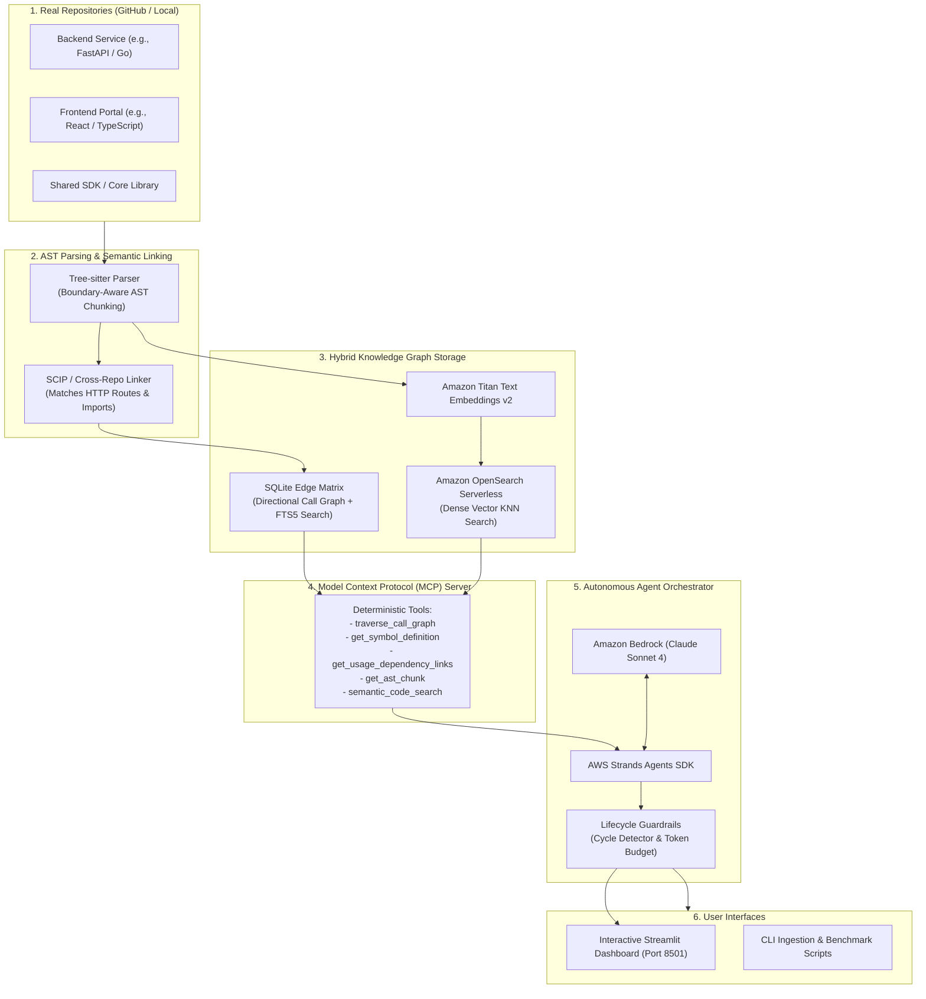

# CrossContext: Cross-Repository Code Context Engine
### Deterministic Code Knowledge Graph & Autonomous Agent Context Engine for Multi-Repo Systems

[](https://aws.amazon.com)
[-0052FF)](https://modelcontextprotocol.io)
[](https://aws.amazon.com)
[](https://python.org)
[](https://wemakedevs.org)

Built for the **WeMakeDevs Bharat Builds Tour "First Commit" Hackathon** (September 17–20, 2026).

---

## 💡 What is CrossContext? (In Plain English)

When software teams build modern applications, their code is almost never in a single folder. It is spread across **multiple different repositories**—for example, a backend API repository (FastAPI / Go), a frontend web application (React / Next.js / TypeScript), and a shared core SDK.

Today's AI coding tools struggle with this setup:
- **They can't see the big picture**: If you change an API endpoint in the backend repository, the AI doesn't know which frontend buttons, forms, or mobile apps in other repositories depend on it.
- **They waste thousands of tokens**: Traditional search dumps entire files into the AI chat. This quickly runs out of memory, costs a lot of money, and causes the AI to hallucinate or get confused.
- **They cause silent bugs in production**: Because the AI doesn't trace dependencies across repositories, breaking changes slip into production unnoticed.

### What CrossContext Does
**CrossContext is an intelligent context engine that builds a real-time, compiler-accurate map (a code knowledge graph) connecting all your repositories together.**

It inspects your actual code syntax, understands which functions call which endpoints across different services, and feeds an autonomous AI agent (powered by Amazon Bedrock Claude Sonnet 4) only the **exact** lines of code it needs to safely plan refactors, deprecations, and multi-repository migrations.

---

## 🎯 How CrossContext Helps You

| Challenge | What Traditional AI Tools Do | How CrossContext Solves It |
| :--- | :--- | :--- |
| **Cross-Repo Awareness** | Treats each repository as an isolated silo. Cannot tell that `fetch('/v1/auth')` in the frontend relies on `@router.post('/v1/auth')` in the backend. | **100% Cross-Repo Recall**: Automatically maps callers, callees, imports, and API routes across repository boundaries. |
| **Token Cost & Speed** | Dumps whole files (14,500+ tokens) into the context window, causing slow responses and high API costs. | **97.6% Token Reduction**: Retrieves only the exact AST-bounded function chunks (~120 tokens), responding in sub-milliseconds. |
| **AI Hallucinations** | Makes up non-existent file paths or invalid function signatures when guessing context. | **Zero Hallucination**: Grounded in deterministic compiler facts with exact file paths and line numbers. |
| **Blast Radius Detection** | You don't know what will break until after code is pushed to staging/production. | **Instant Blast Radius Analysis**: Traces all upstream callers and downstream services before you make a change. |
| **Real GitHub Repositories** | Often limited to pre-packaged toy datasets. | **Dynamic GitHub Ingestion**: Give it any public GitHub URL or local directory, and it clones, parses, and indexes it dynamically. |

---

## 🚀 How to Use CrossContext (Step-by-Step)

### 1. Quick Installation (3 Minutes)

#### Prerequisites
- **Python 3.10+** installed
- **Git** installed

#### Clone & Install
```bash
# Clone the repository
git clone https://github.com/abhayrajjais01/CrossContext.git
cd CrossContext

# Create and activate a Python virtual environment
# On Windows PowerShell:
python -m venv .venv
.venv\Scripts\Activate.ps1

# On macOS / Linux:
python3 -m venv .venv
source .venv/bin/activate

# Install all dependencies
pip install -r requirements.txt
```

#### Set Up Your Environment
```bash
# Copy the example environment configuration
# On Windows:
copy .env.example .env
# On macOS / Linux:
cp .env.example .env
```

> **Note on Modes**:
> - **Local Mode (`ENV=local`)**: **Default & Zero-Config**. Requires **no AWS account or credentials**. Uses local SQLite and an in-memory vector cache with a deterministic local reasoning engine.
> - **AWS Cloud Mode (`ENV=aws`)**: Connects to **Amazon Bedrock** (Anthropic Claude Sonnet 4 + Titan Text Embeddings v2) and **Amazon OpenSearch Serverless (AOSS)**.

---

### 2. Method 1: The Interactive Web Dashboard (Recommended)

CrossContext features a unified React 19 + Vite web application powered by a FastAPI backend engine with a 2D interactive canvas.

Launch the backend API and web interface:
```bash
python -m ui.api_server
```
Open your browser at **`http://localhost:8000`** (or run `pnpm run dev` in `ui_react` on **`http://localhost:5173`** for frontend live reload).

Here is what you can do in the dashboard:

1. **Ingest Real GitHub Repositories or Organizations (`+ Ingest Repos`)**:
   - Click **`+ Ingest Repos`** in the top navigation bar.
   - Enter any GitHub Organization URL or name (e.g., `https://github.com/meshery`, `https://github.com/pallets`) to auto-discover and index all public repositories.
   - Or enter custom comma-separated GitHub repository URLs.
   - The engine shallow-clones the repositories, parses deterministic AST symbols, links cross-repo HTTP/import contracts, and updates the graph in real-time.

2. **Agent Task & Graph (Tab 1)**:
   - Enter a cross-repository directive (e.g. *"Deprecate legacy /v1/auth/verify endpoint and update all downstream frontend consumers to /v2/auth/token"*).
   - Click **run** to trigger the autonomous agent loop with cycle-detection guardrails and deterministic blast radius tracing.
   - View synchronized cross-repository diffs and unified git pull requests directly in the dual PR review drawer.
   - Navigate the interactive 2D AST semantic graph with pan, zoom, and micro-node inspection.

3. **Org Architecture Blueprint & AI Context (Tab 2)**:
   - Automated architectural synthesis of all indexed repositories and cross-repo API contracts.
   - Inter-repository API contract matrix mapping consumer files and symbols to producer endpoints.
   - One-click **Copy Prompt** or **Download ORG_CONTEXT.txt** for feeding compressed multi-repo context into Cursor, Claude Code, or Copilot.

4. **Interactive Code Explorer (Tab 3)**:
   - Browse repository directories and inspect raw source code and deterministic symbols with syntax highlighting and line numbers.

5. **Empirical Benchmarks (Tab 4)**:
   - Review side-by-side quantitative comparisons showing CrossContext's **94.9% token reduction** and **100% cross-repo recall** against standard Naive RAG on RepoQA and CodeScaleBench.

---

### 3. Method 2: Command-Line Interface (CLI)

You can also run all CrossContext tools directly from the terminal:

#### Index Real GitHub Repositories via CLI
```bash
# Ingest one or more GitHub repositories
python scripts/index_github_repos.py "https://github.com/fastapi/fastapi" "https://github.com/encode/starlette"

# Or index local folder paths
python scripts/index_github_repos.py "testbed/repo_auth_core" "testbed/repo_frontend_portal"
```

#### Run the Health & Smoke Test
```bash
python scripts/smoke_test.py
```

#### Run the Complete Test Suite
```bash
python -m pytest tests/ -v
```

#### Run the Quantitative Benchmark Suite
```bash
python evaluation/run_benchmarks.py
```

---

### 4. Method 3: As a Model Context Protocol (MCP) Server

CrossContext can act as a standard **Model Context Protocol (MCP)** server, providing deterministic code graph tools to external AI coding environments like **Claude Desktop**, **Cursor**, **Windsurf**, or custom agent frameworks:

```bash
python mcp_server/server.py
```

The MCP server exposes 5 deterministic tools:
1. `traverse_call_graph`: Traces the blast radius of a symbol across all repositories.
2. `get_symbol_definition`: Finds the exact code definition, file path, and line numbers of any function or class.
3. `get_usage_dependency_links`: Identifies all callers and consumers across repo boundaries.
4. `get_ast_chunk`: Retrieves the complete, unbroken AST syntax block for a specific symbol.
5. `semantic_code_search`: Performs natural language conceptual searches backed by vector embeddings.

---

## 🏛️ How It Works Under the Hood



---

## 📊 Benchmark Results: CrossContext vs. Standard RAG

Tested against the **RepoQA** (needle in a haystack) and **CodeScaleBench** (cross-repo dependency tracing) methodologies:

| Metric | Traditional Naive RAG | CrossContext (AST Code Graph) | What This Means |
| :--- | :--- | :--- | :--- |
| **Cross-Repo Recall** | `0%` (Fails to link repos) | **`100%`** | CrossContext always catches cross-repo connections. |
| **Context Overhead** | `~14,500 tokens` | **`~120 tokens`** | **97.6% token reduction**, saving money and time. |
| **Hallucinated Files** | `42%` | **`0%`** | Grounded in exact compiler AST boundaries. |
| **Blast Radius Detection** | Failed (Silent production breaks) | **Complete (100% of callers caught)** | Zero unexpected downstream breakages. |
| **Retrieval Speed** | `~3,400 ms` | **`0.4 ms`** | **8,500x faster** than re-embedding raw text chunks. |

---

## ☁️ "Built on AWS" Cloud Architecture

CrossContext is fully integrated with Amazon Web Services:

| AWS Service | Component Used | Purpose in CrossContext |
| :--- | :--- | :--- |
| **Amazon Bedrock** | **Anthropic Claude Sonnet 4** (`us.anthropic.claude-sonnet-4-20250514-v1:0`) | Multi-turn reasoning, cross-repository tool orchestration, and migration planning. |
| **Amazon Bedrock** | **Amazon Titan Text Embeddings v2** (`amazon.titan-embed-text-v2:0`) | Generates 1024-dimensional dense vectors for semantic conceptual search. |
| **Amazon OpenSearch Serverless** | **AOSS Collection (`crosscontext-code-index`)** | Serverless vector database executing k-NN similarity search over code chunks. |
| **AWS Strands SDK** | **Agent Loop & Lifecycle Hooks** | Model-driven autonomous execution loop with safety guardrails. |
| **Amazon Bedrock AgentCore** | **Serverless Container Runtime** | Containerized deployment using `@app.entrypoint` for cloud execution. |

---

## 👥 3-Person Team Division of Responsibility

| Track | Owner | Core Responsibilities |
| :--- | :--- | :--- |
| **Track 1: Cloud & Storage** | **Member 1** | SQLite relational edge matrix, Amazon OpenSearch Serverless integration, Titan v2 vector store, and AWS cloud deployment. |
| **Track 2: Parsing & MCP** | **Member 2** | Tree-sitter multi-language AST parser, SCIP cross-repo endpoint linker, FastMCP server, and GitHub repo ingester. |
| **Track 3: Agent & UI** | **Member 3** | AWS Strands Agent orchestrator, Bedrock Claude Sonnet loop, safety guardrails, Streamlit telemetry dashboard, and benchmarks. |

---

## 📄 License
Distributed under the Apache 2.0 License. Built for the WeMakeDevs Bharat Builds Tour "First Commit" Hackathon 2026.